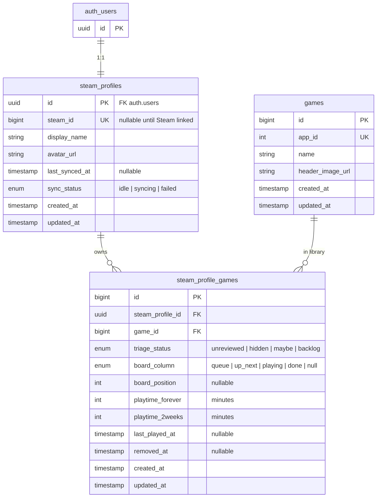

# Data model

Decisions from a grilling session (MXB-21), revised for Steam profile naming and Supabase Auth. Complements [positioning](positioning.md) (MXB-23), [success metrics](success-metrics.md) (MXB-22), and [MXB-26](https://linear.app/steam-backlog/issue/MXB-26) (Next.js + Supabase). Domain language lives in [`CONTEXT.md`](../CONTEXT.md).

## Overview

Three domain tables. Auth identity lives in Supabase Auth (`auth.users`); the domain profile is `steam_profiles` (1:1 with `auth.users`). Steam game metadata is normalized in `games`. Per-profile ownership, triage, board placement, and playtime live in `steam_profile_games`. Sync status lives on `steam_profiles`; no sync history table for MVP.

## Tables

### `steam_profiles`

Domain Steam profile. Primary key is the same uuid as `auth.users.id` (cascade delete). Steam identity via `steam_id` (nullable until linked). Email/password live only on `auth.users` (MXB-6).

| Column | Type | Notes |
|---|---|---|
| `id` | uuid PK | FK → `auth.users(id)`, cascade delete |
| `steam_id` | bigint unique nullable | Steam 64-bit ID; set when Steam linked |
| `display_name` | string | From Steam profile (or auth metadata) |
| `avatar_url` | string | From Steam profile (or auth metadata) |
| `last_synced_at` | timestamp nullable | Last successful library sync |
| `sync_status` | enum | `idle`, `syncing`, `failed` |
| `created_at`, `updated_at` | timestamps | |

### `games`

Shared Steam catalog. One row per `app_id`. Updated on sync when metadata changes.

| Column | Type | Notes |
|---|---|---|
| `id` | bigint PK | |
| `app_id` | int unique | Steam application ID |
| `name` | string | Display name |
| `header_image_url` | string | Cover art URL |
| `created_at`, `updated_at` | timestamps | |

Store delisted status is **not** tracked. If the steam profile still owns the game, store policy is irrelevant.

### `steam_profile_games`

A steam profile's library entry for one game. Triage and board are **two independent axes**.

| Column | Type | Notes |
|---|---|---|
| `id` | bigint PK | |
| `steam_profile_id` | uuid FK → steam_profiles | |
| `game_id` | bigint FK → games | |
| `triage_status` | enum | `unreviewed`, `hidden`, `maybe`, `backlog` |
| `board_column` | enum nullable | `queue`, `up_next`, `playing`, `done` |
| `board_position` | int nullable | Order within column (0, 1, 2…) |
| `playtime_forever` | int | Minutes, from Steam |
| `playtime_2weeks` | int | Minutes, from Steam |
| `last_played_at` | timestamp nullable | From Steam `rtime_last_played` |
| `removed_at` | timestamp nullable | Set when game drops from `GetOwnedGames` |
| `created_at`, `updated_at` | timestamps | |

New rows default to `triage_status = unreviewed` with null board fields.

## Constraints & indexes

| Rule | Implementation |
|---|---|
| One steam profile per Steam identity | `UNIQUE(steam_id)` on `steam_profiles` |
| One catalog row per Steam game | `UNIQUE(app_id)` on `games` |
| One library entry per owned game | `UNIQUE(steam_profile_id, game_id)` on `steam_profile_games` |
| No duplicate slots in a board column | Partial unique index on `(steam_profile_id, board_column, board_position)` WHERE `board_column IS NOT NULL` |
| Account delete | `steam_profile_games` cascades on `steam_profiles` delete; `steam_profiles` cascades on `auth.users` delete |
| Shared catalog | `steam_profile_games.game_id` FK restrict (do not delete `games` rows in use) |

## Application invariants

Enforced in the application layer for MVP, not Postgres check constraints.

1. **Board only for backlog.** `board_column` and `board_position` are non-null only when `triage_status = backlog`.
2. **Hide clears board.** Setting `triage_status = hidden` also sets `board_column` and `board_position` to null.
3. **Idempotent sync.** Re-import updates playtime and game metadata; never resets `triage_status` or board fields (MXB-44).
4. **Removed, not deleted.** When a game disappears from `GetOwnedGames`, set `removed_at`. Do not reset triage or board state.
5. **Board ordering.** `board_position` is an integer rank per `(steam_profile_id, board_column)`. Reorder rewrites positions in that column.

## Sync model

No `library_syncs` table for MVP. Background sync (MXB-33) uses a job runner TBD. Visible status:

- `steam_profiles.sync_status` — current state (`idle` / `syncing` / `failed`)
- `steam_profiles.last_synced_at` — last successful completion

Structured logging for sync runs is ops concern (MXB-57), not a domain table.

## Explicitly out of scope (MVP)

- `library_syncs` run history table
- `games.is_delisted` or other store-policy flags
- Email/password columns on `public.steam_profiles` (those live in `auth.users`)
- `first_seen_at` / new-game badge fields
- Postgres check constraints on triage/board invariants

## Downstream issues

These issues implement against this model:

- **MXB-31** — migrations for `steam_profiles`, `games`, `steam_profile_games`
- **MXB-6** — Supabase Auth; profile row in `public.steam_profiles`
- **MXB-8** — `GetOwnedGames` upserts `games` + `steam_profile_games`
- **MXB-11** — board queries `triage_status = backlog` with board columns
- **MXB-44** — sync preserves triage and board state
